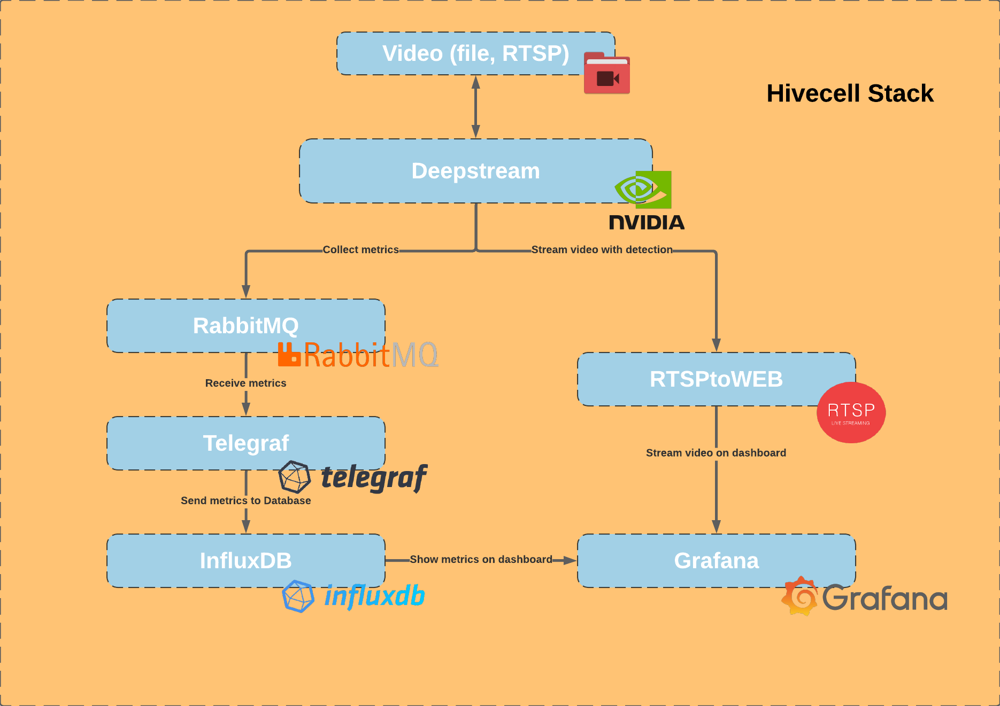
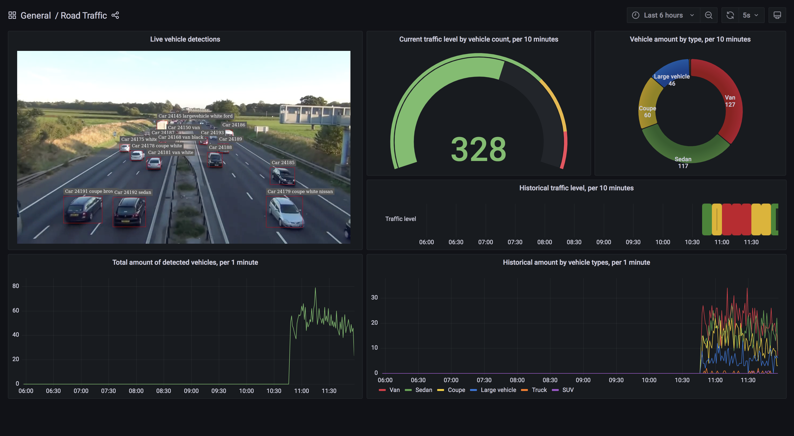

# Road Traffic Analytics Helm chart

Road Traffic Analytics - application that analyze vehicle traffic situation using NVIDIA DeepStream SDK. This toolkit detecting vehicles using object detection model Restnet10 as a primary model, then send detected objects to secondary model Resnet18 to detect vehicle types. Each detection generates a message that stored in InfluxDB using RebbitMQ as a message broker and Telegraf as a data collector and a transformer. RTSP video stream with vehicle detections is a second output from Deepstream. It's available on a Grafana dashboard with analytics charts based on stored data in InfluxDB.

# Introduction

This Helm chart installs road traffic analytics application in a Kubernetes cluster.\
The Road Traffic Analytics Helm chart uses the [Helm](https://helm.sh) package manager to bootstrap a Road Traffic Analytics (`road-traffic-analytics`) deployment on a [Kubernetes](http://kubernetes.io) cluster.

# Prerequisites

- Kubernetes 1.4+ with beta APIs enabled
- Helm 3.0+
- PV provisioner support in the underlying infrastructure.

# Application architucture


# Configure the chart

The ``/charts`` directory includes all the helm charts needed to run the demo app. In each directorys there is a values.yaml file with all configuration settings.

### Main Charts.yaml 
In the Charts.yaml file includes all the dependencies with their versions to run the demo app.

### Directory charts
The /charts directory includes all the helm charts needed to run the demo app. In each directorys there is a values.yaml file with all configuration settings.
 - `road-traffic-analytics`:
    - `/charts` - Directory includes all the helm charts
        - [/grafana](./charts/grafana) - Grafana is analytics & monitoring solution that we use to show metrics and online video streams on a single dashboard.
        - [/influxdb](./charts/influx) - InfluxDB is a time series database that we use to store data from the deepstream.
        - [/rabbitmq-ha](.charts/rabbitmq-ha) - RabbitMQ is a message broker that receives data from the deepstream and sends it to the telegraf. 
        - [/telegraf](.charts/telegraf) - This plugin gathers statistics from RabbitMQ and sends data to InfluxDB
        - [/video-analytics-demo](./video-analytics-demo) - NVIDIA DeepStream SDK delivers a complete streaming analytics toolkit for AI-based multi-sensor processing, video and image understanding. We use object detection to detect vehicle and secondary models to detect type and make of a vehicle
        - [/video-stream-service](./charts/video-stream-service) - Stream service that use HLS protocol and streams the video on the dashboard in Grafana
    - `templates` - The file that gives the output after successfully installing the helm demo in the command line.
    - ``.helmignore`` - Patterns to ignore when building packages
    - `Chart.yaml` - File includes all the dependencies with their versions to run the demo app.
    - `values.yaml` - Describes which helm charts we include in the main Chart.yaml 

> **Tip**: If you want to deploy the application on `MicroK8s` you need to change the default value of `StorageClass` from `ceph-rbd` to `rook-cephfs` in [/road-traffic-analytics/charts/grafana/values.yaml](./charts/influxdb/values.yaml#L45)
  

# Manual installation the chart

1. Add the Road Traffic Analytics Helm repository:

   ```bash
   git clone https://github.com/hivecell-io/road-traffic-analytics.git
   ```

2. Run the following command, providing a name for your Road Traffic Analytics application release:

   ```bash
   helm install helm-demo road-traffic-analytics/
   ```

   > **Tip**: you should to use only `helm-demo` name.
   This command deploys Road Traffic Analytics application on the Kubernetes cluster using the default configuration. To find parameters you can configure during installation, see [Configure the chart](#configure-the-chart).

   > **Tip**: To view all Helm chart releases, run `helm list`.

3. View the pods: 

    ```bash
    kubectl get pods
    ```
# Automatic installation the chart

1. Download `*.tgz` file with Road Traffic Analytics application in Releases

2. Use `Hive Control` UI

3. Upload `*.tgz` file on `Hive Control` UI and deploy application

# Uninstall the chart

To uninstall the `road-traffic-analytics` application, use the following command:

```bash
helm delete helm-demo
```

# Result

Open the web page with video stream and metrics in the Gradana dashboard at the followind link ``<your_node_ip>:30300``
